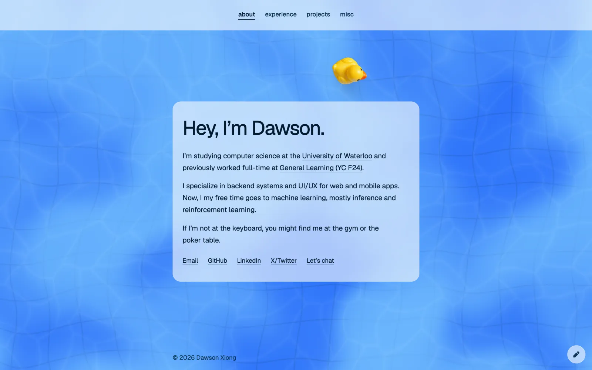

# personal-website

My personal site: a portfolio set over an interactive pool.

Live at [dawsonxiong.com](https://www.dawsonxiong.com).



## Features

- The water, caustics, shadows and wakes are drawn by a WebGL2 shader, without three.js or any other 3D engine
- Floaties drift around, bob and bump into each other, using a small physics solver I wrote
- They also steer around the text so they don't cover it
- About, experience, projects and misc tabs. Arrow keys work and each tab has its own URL hash
- Honours reduced motion, and pauses when you switch tabs

## Stack

Next.js 16, React 19, TypeScript, Tailwind v4, shadcn/ui, Base UI, WebGL2. Hosted on Vercel.

## Running locally

Requires Node 22 and pnpm.

Icons are [Heroicons](https://heroicons.com/) (20px solid), imported through
`@/components/icons`. The GitHub mark is an inline SVG in `brand-icons.tsx`.

```sh
pnpm install
pnpm dev
```

Other scripts: `pnpm test`, `pnpm lint`, `pnpm format`, `pnpm typecheck`, `pnpm build`.

## Structure

- `src/content/portfolio.ts`: experience, projects and misc content.
- `src/components/pool-hero/`: water renderer, shaders and floatie physics.
- `src/components/portfolio/`: tabs and work sample carousels.
- `public/portfolio/`: screenshots and videos.

## Deploying

Import it into Vercel. It doesn't need any environment variables, and Vercel's pnpm switches to the
pinned `packageManager` version on its own. If a build shows pnpm 9 failing with `packages field missing`,
also set `ENABLE_EXPERIMENTAL_COREPACK=1`.
